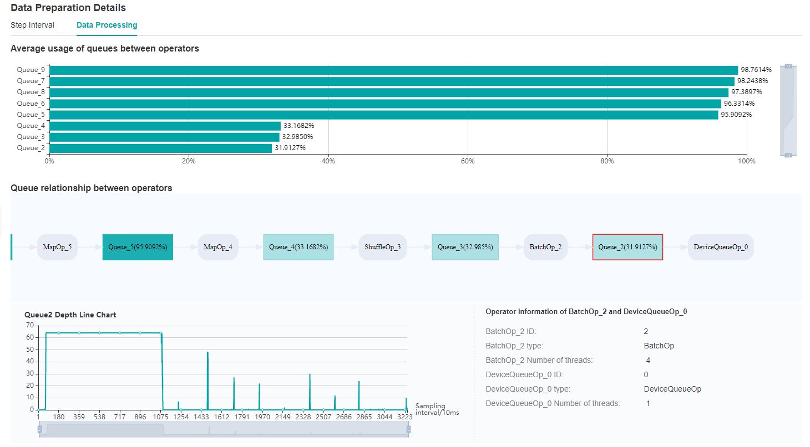
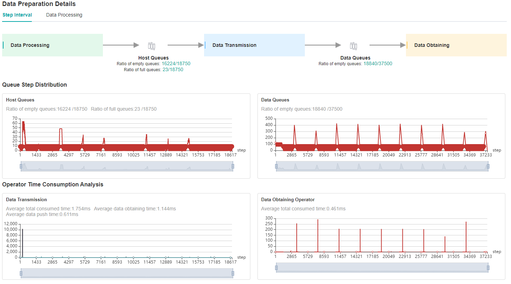
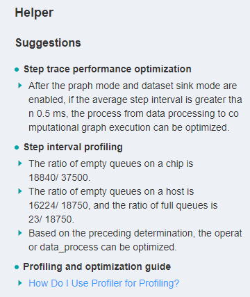
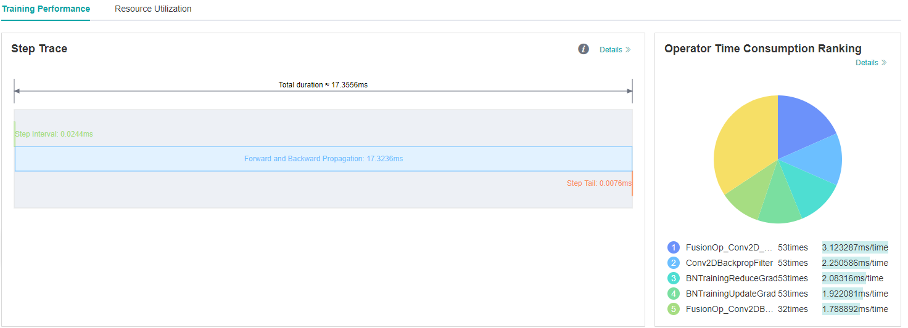
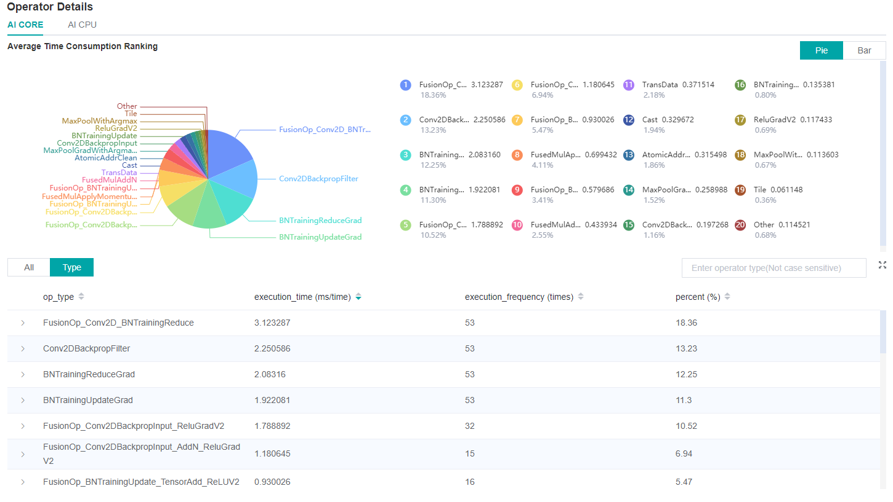

# Using Performance Profiling Tool

<!-- TOC -->

- [Quick Start](#quick-start)
    - [Case 1: Long Step Interval](#case-1-long-step-interval)
    - [Case 2: Long Forward and Backward Propagation Interval Caused by Operations](#case-2-long-forward-and-backward-propagation-interval-caused-by-operations)
    - [Case 3: Long Forward and Backward Propagation Interval Caused by Operation Intervals](#case-3-long-forward-and-backward-propagation-interval-caused-by-operation-intervals)
- [FAQ](#faq)

<!-- /TOC -->

<a href="https://gitee.com/mindspore/docs/blob/master/docs/migration_guide/source_en/performance_optimization.md" target="_blank"></a>

Profiler provides performance tuning ability for MindSpore, and provides easy-to-use and rich debugging functions in operator performance, iteration performance, data processing performance, etc., helping users quickly locate and solve performance problems.

This chapter introduces the common methods and cases of performance tuning in neural networks, as well as the resolution of some common problems.

## Quick Start

Please refer to the tutorials for the function introduction and instructions of MindSpore Profiler.

[Performance Profiling（Ascend）](https://mindspore.cn/tutorial/training/en/master/advanced_use/performance_profiling_ascend.html)

[Performance Profiling（GPU）](https://mindspore.cn/tutorial/training/en/master/advanced_use/performance_profiling_gpu.html)

This section will introduce the common use of MindSpore Profiler through three typical cases.

### Case 1: Long Step Interval

As you observed on the MindInsight UI page, the step interval in the ```Step Trace``` is too long, which may indicate that performance can be optimized in the dataset processing process.


Figure 1: Long Step Interval in Step Trace

Looking at the ```Data Preparation``` details at the bottom of the webpage, we can see that the ratio of full queues in ```Host Queue``` is low, which can be preliminarily determined that the performance related to dataset processing can be improved.

It could be a bottleneck of dataset operators or TDT channel transmission. Switch to the ```Data Processing``` page to check it.



Figure 2: Data Preparation Details -- Step Interval



Figure 3: Data Preparation Details -- Data Processing

By observing the ```Queue relationship between operators```, we find that the average usage of ```Queue_3``` and ```Queue_2``` is relatively inefficient.

Therefore, it can be determined that we can adjust the corresponding dataset operators, ```ShuffleOp_3``` and ```BatchOp_2```, to achieve better performance. Then, you can adjust the training script based on this information.

You can also refer to the suggestion provided by the ```Helper``` on the left side of the home page to optimize the training script.



Figure 4: Helper

### Case 2: Long Forward and Backward Propagation Interval Caused by Operations

When you find that the running time of steps is too long, you can first check the ```Step Trace``` to see if the time distribution of each part is normal.



Figure 5: Long FP/BP intervals in ```Step Trace```

From the ```Step Trace``` in Figure 5, it is observed that the forward and backward propagation time is too long.

We can open the details page of ```Operator Time Consumption Ranking``` to further determine whether there are time-consuming operators, and judge whether there is optimization method to reduce the operator execution time.



Figure 6: Finding operators that can be optimized via the details page of ```Operator Time Consumption Ranking```

### Case 3: Long Forward and Backward Propagation Interval Caused by Operation Intervals

In case 2, we introduced the case of long execution time of operations. In addition, the long FP/BP time can also be caused by the long time intervals among operations.

To determine if there are long operation intervals, we can observe details of ```Timeline```.

Click the ```Download``` button on the ```Timeline``` card in the right bottom of the UI page to download the timeline data.

After downloading is done, enter the address ```chrome://tracing``` in Google browser, upload or drag the downloaded file into the browser to load data.


Figure 7: Finding intervals between operations that can be optimized in ```Timeline```.

If it is found that there is a large interval between operations, you can adjust the training script to optimize this section to further improve the performance.

## FAQ

### Startup Failure

If you encounter the error of startup failure, you can check whether you encountered one of the following situations:

- There is no space left in the system, or the remaining space is too small to run profiling tool.
- Mismatched versions of MindSpore and Ascend AI processor software package.
