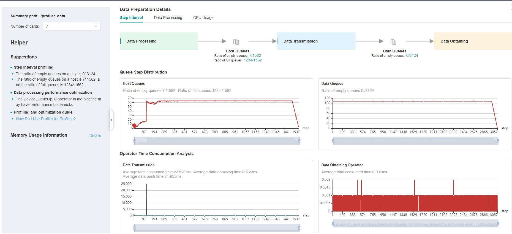
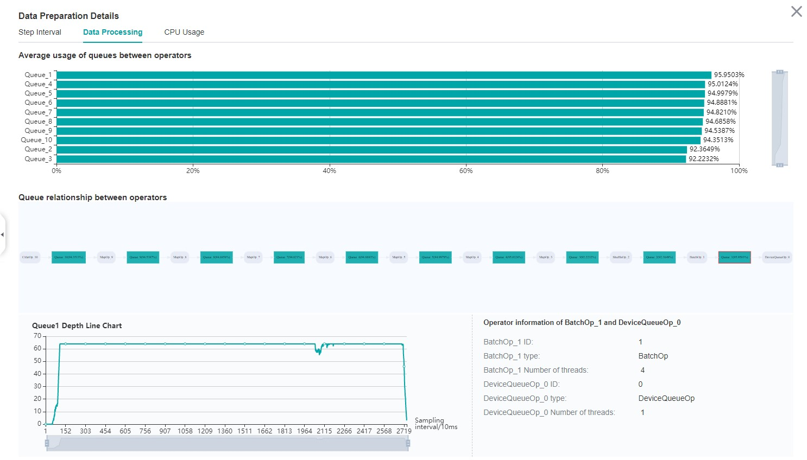
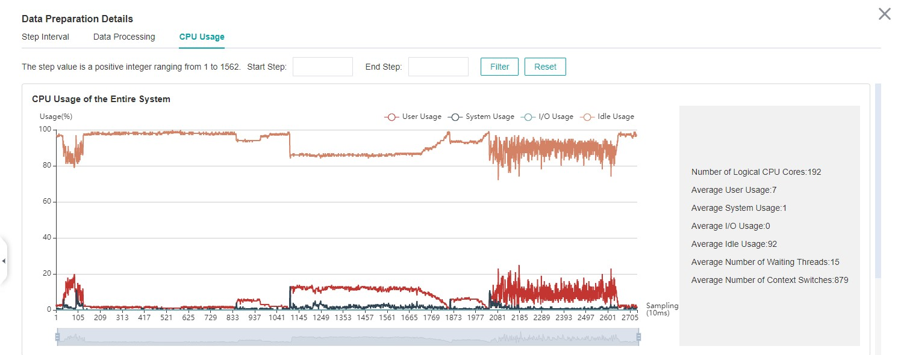
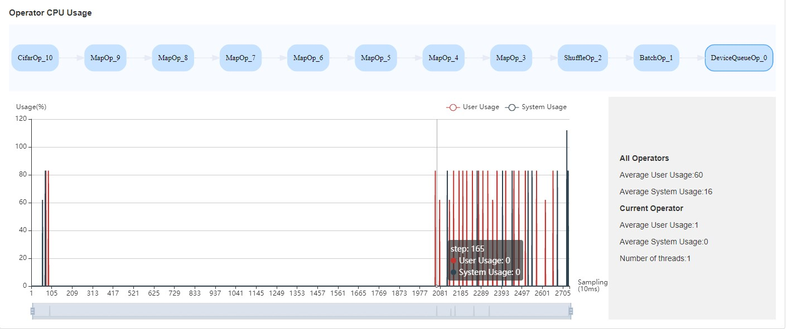

# Performance Profiling (Ascend)

`Linux` `Ascend` `Model Optimization` `Intermediate` `Expert`

<!-- TOC -->

- [Performance Profiling (Ascend)](#performance-profiling-ascend)
    - [Overview](#overview)
    - [Operation Process](#operation-process)
    - [Preparing the Training Script](#preparing-the-training-script)
    - [Launch MindInsight](#launch-mindinsight)
        - [Performance Analysis](#performance-analysis)
            - [Step Trace Analysis](#step-trace-analysis)
            - [Operator Performance Analysis](#operator-performance-analysis)
            - [Data Preparation Performance Analysis](#data-preparation-performance-analysis)
            - [Timeline Analysis](#timeline-analysis)
            - [Memory Analysis](#memory-analysis)
    - [Specifications](#specifications)
    - [Notices](#notices)

<!-- /TOC -->

<a href="https://gitee.com/mindspore/docs/blob/master/tutorials/training/source_en/advanced_use/performance_profiling.md" target="_blank"></a>

## Overview

This article describes how to use MindSpore Profiler for performance debugging on Ascend AI processors.

## Operation Process

- Prepare a training script, add profiler APIs in the training script and run the training script.
- Start MindInsight and specify the summary-base-dir using startup parameters, note that summary-base-dir is the parent directory of the directory created by Profiler. For example, the directory created by Profiler is `/home/user/code/data/`, the summary-base-dir should be `/home/user/code`. After MindInsight is started, access the visualization page based on the IP address and port number. The default access IP address is `http://127.0.0.1:8080`.
- Find the training in the list, click the performance profiling link and view the data on the web page.

## Preparing the Training Script

To enable the performance profiling of neural networks, MindSpore Profiler APIs should be added into the script. At first, the MindSpore `Profiler` object need to be set after `set_context` is set and before the network and HCCL initialization. Then, at the end of the training, `Profiler.analyse()` should be called to finish profiling and generate the perforamnce analyse results.

> The parameters of Profiler are as follows:
>
> <https://www.mindspore.cn/doc/api_python/en/master/mindspore/mindspore.profiler.html>

The sample code is as follows:

```python
from mindspore.profiler import Profiler
from mindspore import Model, nn, context

# Init context env
context.set_context(mode=context.GRAPH_MODE, device_target='Ascend', device_id=int(os.environ["DEVICE_ID"]))

# Init Profiler
# Note that 'data' directory is created in current path by default. To visualize the profiling data by MindInsight,
# 'data' directory should be placed under summary-base-dir.
profiler = Profiler()

# Train Model
Model.train()

# Profiler end
profiler.analyse()
```

## Launch MindInsight

The MindInsight launch command can refer to [MindInsight Commands](https://www.mindspore.cn/tutorial/training/en/master/advanced_use/mindinsight_commands.html).

### Performance Analysis

Users can access the Performance Profiler by selecting a specific training from the training list, and click the performance profiling link.


Figure 1: Overall Performance

Figure 1 displays the overall performance of the training, including the overall data of Step Trace, Operator Performance, Data Preparation Performance and Timeline. The data shown in these components include:  

- Step Trace: It will divide the training steps into several stages and collect execution time for each stage. The overall performance page will show the step trace graph.
- Operator Performance: It will collect the execution time of operators and operator types. The overall performance page will show the pie graph for different operator types.
- Data Preparation Performance: It will analyse the performance of the data input stages. The overall performance page will show the number of steps that may be the bottleneck for these stages.
- Timeline: It will collect execution time for stream tasks on the devices. The tasks will be shown on the time axis. The overall performance page will show the statistics for streams and tasks.  

Users can click the detail link to see the details of each components. Besides, MindInsight Profiler will try to analyse the performance data, the assistant on the left will show performance tuning suggestions for this training.

#### Step Trace Analysis

The Step Trace Component is used to show the general performance of the stages in the training. Step Trace will divide the training into several stages:  
Step Gap (The time between the end of one step and the computation of next step), Forward/Backward Propagation, All Reduce and Parameter Update. It will show the execution time for each stage, and help to find the bottleneck stage quickly.


Figure 2: Step Trace Analysis

Figure 2 displays the Step Trace page. The Step Trace detail will show the start/finish time for each stage. By default, it shows the average time for all the steps. Users can also choose a specific step to see its step trace statistics. The graphs at the bottom of the page show the execution time of Step Gap, Forward/Backward Propagation and Step Tail (The time between the end of Backward Propagation and the end of Parameter Update) changes according to different steps, it will help to decide whether we can optimize the performance of some stages.

In order to divide the stages, the Step Trace Component need to figure out the forward propagation start operator and the backward propagation end operator. MindSpore will automatically figure out the two operators to reduce the profiler configuration work. The first operator after `get_next` will be selected as the forward start operator and the operator before the last all reduce will be selected as the backward end operator.
**However, Profiler do not guarantee that the automatically selected operators will meet the user's expectation in all cases.** Users can set the two operators manually as follows:  

- Set environment variable `PROFILING_FP_START` to configure the forward start operator, for example, `export PROFILING_FP_START=fp32_vars/conv2d/BatchNorm`.
- Set environment variable `PROFILING_BP_END` to configure the backward end operator, for example, `export PROFILING_BP_END=loss_scale/gradients/AddN_70`.

#### Operator Performance Analysis

The operator performance analysis component is used to display the execution time of the operators during MindSpore run.


Figure 3: Statistics for Operator Types

Figure 3 displays the statistics for the operator types, including:  

- Choose pie or bar graph to show the proportion time occupied by each operator type. The time of one operator type is calculated by accumulating the execution time of operators belonging to this type.
- Display top 20 operator types with the longest execution time, show the proportion and execution time (ms) of each operator type.


Figure 4: Statistics for Operators

Figure 4 displays the statistics table for the operators, including:  

- Choose All: Display statistics for the operators, including operator name, type, execution time, full scope time, information, etc. The table will be sorted by execution time by default.
- Choose Type: Display statistics for the operator types, including operator type name, execution time, execution frequency and proportion of total time. Users can click on each line, querying for all the operators belonging to this type.
- Search: There is a search box on the right, which can support fuzzy search for operators/operator types.

#### Data Preparation Performance Analysis

The Data preparation performance analysis component is used to analyse the execution of data input pipeline for the training. The data input pipeline can be divided into three stages:  
the data process pipeline, data transfer from host to device and data fetch on device. The component will analyse the performance of each stage in detail and display the results.



Figure 5: Data Preparation Performance Analysis

Figure 5 displays the page of data preparation performance analysis component. It consists of three tabs: The step gap, the data process, and the CPU utilization.

The step gap page is used to analyse whether there is performance bottleneck in the three stages. We can get our conclusion from the data queue graphs:  

- The data queue size stands for the queue length when the training fetches data from the queue on the device. If the data queue size is 0, the training will wait until there is data in the queue; If the data queue size is greater than 0, the training can get data very quickly, and it means data preparation stage is not the bottleneck for this training step.
- The host queue size can be used to infer the speed of data process and data transfer. If the host queue size is 0, it means we need to speed up the data process stage.
- If the size of the host queue is always large and the size of the data queue is continuously small, there may be a performance bottleneck in data transfer.



Figure 6: Data Process Pipeline Analysis

Figure 6 displays the page of data process pipeline analysis. The data queues are used to exchange data between the data processing operators. The data size of the queues reflect the data consume speed of the operators, and can be used to infer the bottleneck operator. The queue usage percentage stands for the average value of data size in queue divide data queue maximum size, the higher the usage percentage, the more data that is accumulated in the queue. The graph at the bottom of the page shows the data processing pipeline operators with the data queues, the user can click one queue to see how the data size changes according to the time, and the operators connected to the queue. The data process pipeline can be analysed as follows:  

- When the input queue usage percentage of one operator is high, and the output queue usage percentage is low, the operator may be the bottleneck.
- For the leftmost operator, if the usage percentage of all the queues on the right are low, the operator may be the bottleneck.
- For the rightmost operator, if the usage percentage of all the queues on the left are high, the operator may be the bottleneck.

To optimize the performance of data processing operators, there are some suggestions:  

- If the Dataset Operator is the bottleneck, try to increase the `num_parallel_workers`.
- If a GeneratorOp type operator is the bottleneck, try to increase the `num_parallel_workers` and replace the operator to `MindRecordDataset`.
- If a MapOp type operator is the bottleneck, try to increase the `num_parallel_workers`. If it is a python operator, try to optimize the training script.
- If a BatchOp type operator is the bottleneck, try to adjust the size of `prefetch_size`.

CPU utilization, which is mainly used to assist performance debugging. After the performance bottleneck is determined according to the queue size, the performance can be debugged according to the CPU utilization (if the user utilization is too low, increase the number of threads; if the system utilization is too high, decrease the number of threads).
CPU utilization includes CPU utilization of the whole machine, process and Data pipeline operator.



Figure 7: CPU utilization of the whole machine

CPU utilization of the whole machine: Show the overall CPU usage of the device in the training process, including user utilization, system utilization, idle utilization, IO utilization, current number of active processes, and context switching times. If the user utilization is low, you can try to increase the number of operator threads to increase the CPU utilization; if the system utilization is high, and the number of context switching and CPU waiting for processing is large, it indicates that the number of threads needs to be reduced accordingly.


Figure 8: Process utilization

Process utilization: Show the CPU usage of a single process. The combination of whole machine utilization and process utilization can determine whether other processes affect the training process.



Figure 9: Operator utilization

Operator utilization: Show the CPU utilization of Data pipeline single operator. We can adjust the number of threads of the corresponding operator according to the actual situation. If the number of threads is small and takes up a lot of CPU, you can consider whether you need to optimize the code.

Common scenarios of CPU utilization:

- According to the queue size, the network debugging personnel can judge that the performance of MindData has a bottleneck. They can adjust the number of threads by combining the utilization rate of the whole machine and the utilization rate of the operator.
- Developers can check the utilization of operators. If an operator consumes CPU utilization, they can confirm whether the code needs to be optimized.

#### Timeline Analysis

The Timeline component can display:

- The operators (AICore/AICPU operators) are executed on which device.
- The MindSpore stream split strategy for this neural network.
- The execution sequence and execution time of the operator on the device.

Users can get the most detailed information from the Timeline:  

- From the High level, users can analyse whether the stream split strategy can be optimized and whether the step tail is too long.
- From the Low level, users can analyse the execution time for all the operators, etc.

Users can click the download button on the overall performance page to view Timeline details. The Timeline data file (json format) will be stored on local machine, and can be displayed by tools. We suggest to use `chrome://tracing` or [Perfetto](https://ui.perfetto.dev/#!viewer) to visualize the Timeline.  

- Chrome tracing: Click "load" on the upper left to load the file.
- Perfetto: Click "Open trace file" on the left to load the file.


Figure 10: Timeline Analysis

The Timeline consists of the following parts:  

- Device and Stream List: It will show the stream list on each device. Each stream consists of a series of tasks. One rectangle stands for one task, and the area stands for the execution time of the task.
- The Operator Information: When we click one task, the corresponding operator of this task will be shown at the bottom.

W/A/S/D can be applied to zoom in and out of the Timeline graph.

#### Memory Analysis

This page is used to show the memory usage of the neural network model on the **device**, which is an **ideal prediction** based on the theoretical calculation results. The content of the page includes:

- An overview of the memory usage of the model, including the total available memory, peak memory and other information.
- The memory occupied varies in the execution order while the model is running.
- The memory usage of each operator is decomposed and displayed in the table of ```Operator Memory Allocation```.


Figure 8：Memory Analysis

Users can obtain the summary of memory usage via the ```Memory Allocation Overview```. In addition, they can obtain more detailed information from ```Memory Usage```, including:

- **Line Chart**: Changes in model memory usage, including static memory, total occupied memory and total available memory.
- **Zooming**: There is a zoom scroll bar under the line chart. Users can zoom in or out the line chart by adjusting its size to observe more details.
- **FP/BP**: The execution positions of the start of ```Forward Propagation``` and the end of ```Backward Propagation``` of the model on the line chart.
- **Details of Nodes**: Hovering over the line chart, the information of the corresponding execution operator is shown, including the execution order of the operator, the name of the operator, the memory occupied by the operator, the total memory occupied by the model in the current position, and the relative memory change compared with the previous execution position.
- **Memory Decomposition**: Left clicking a position on the line chart, the memory breakdowns of the execution position is shown in the table below the line chart, called ```Operator Memory Allocation```. The table shows the memory decomposition of the corresponding execution position, i.e., the output tensor of which operators are allocated the occupied memory of the current execution position. The module provides users with abundant information, including tensor name, tensor size, tensor type, data type, shape, format, and the active lifetime of tensor memory.


Figure 9：Memory Statistics

## Specifications

- To limit the data size generated by the Profiler, MindInsight suggests that for large neural network, the profiled steps should be less than 10.

  > How to limit step count, Please refer to data preparation tutorial:
  > <https://www.mindspore.cn/tutorial/training/en/master/use/data_preparation.html>

- The parse of Timeline data is time consuming, and usually the data of a few steps is enough to analyze the results. In order to speed up the data parse and UI display, Profiler will show at most 20M data (Contain 10+ step information for large networks).

## Notices

- Currently running in PyNative mode is not supported.
